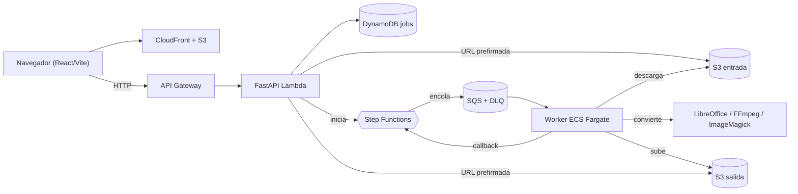
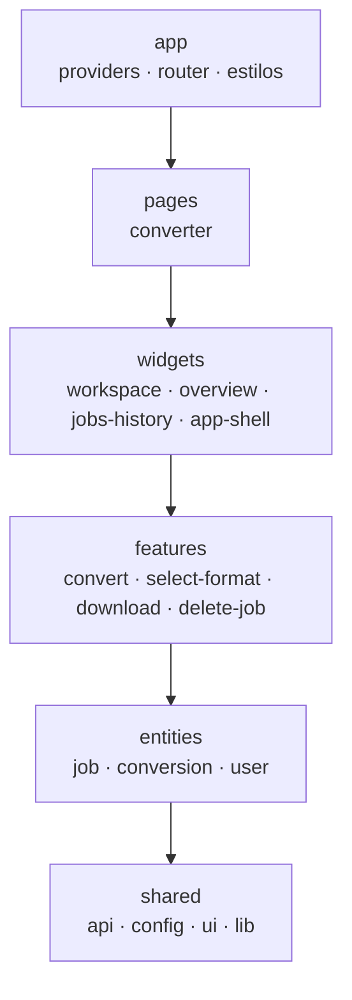
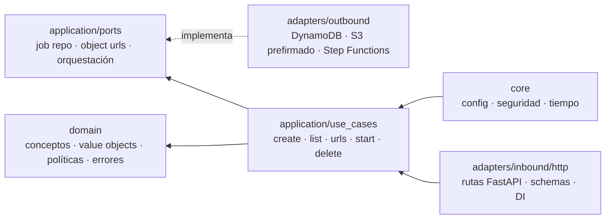
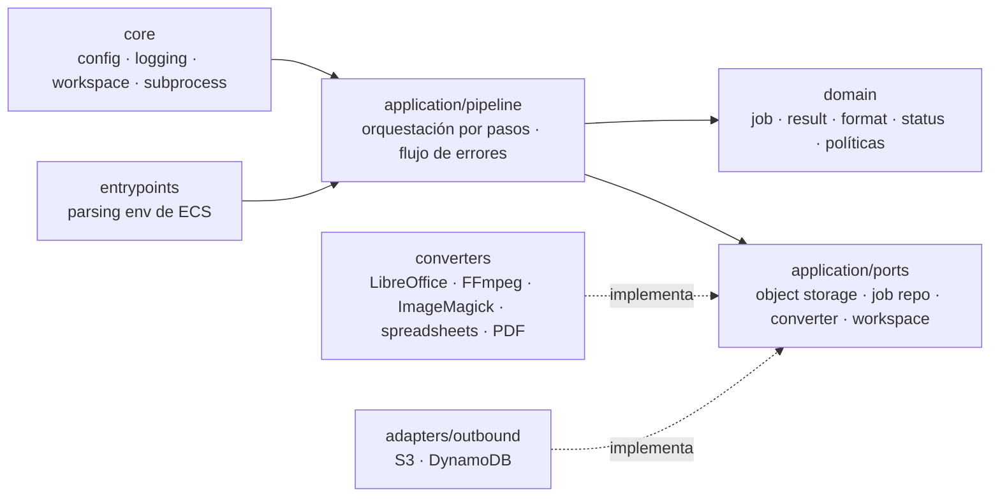

[English](README.md) | [Español](README.es.md)

# Morphix

Aplicación web para conversión asíncrona de archivos sin APIs externas de conversión. Frontend React/Vite, API FastAPI, worker de conversión en Python, infraestructura Terraform/Terragrunt y despliegues con GitHub Actions.

## Arquitectura

Cuatro límites explícitos: el frontend posee el flujo de usuario, la API posee la coordinación de jobs y la seguridad, el worker posee la ejecución de conversiones, y la infraestructura posee el despliegue, aislamiento, almacenamiento y observabilidad.



El flujo de runtime es asíncrono: el frontend se entrega desde S3 a través de CloudFront, la API recibe las solicitudes de job vía API Gateway/Lambda, Step Functions orquesta cada conversión, SQS amortigua la ejecución del worker, y un worker ECS Fargate consume la cola secuencialmente. El navegador nunca recibe credenciales AWS; lee `runtime-config.json` publicado por Terraform para descubrir la URL base de la API y usa URLs prefirmadas para mover archivos directamente hacia/desde S3.

### Frontend — Feature-Sliced Design

`apps/frontend/src` (React 19 + Vite + Tailwind v4 + shadcn/ui, estado de servidor con TanStack Query):



- `app`: bootstrap, providers, router, estilos globales.
- `pages`: composiciones a nivel de ruta.
- `widgets`: bloques completos de UI (workspace de conversión, overview, historial de jobs).
- `features`: acciones de usuario con intención de negocio (convertir archivo, seleccionar formato destino, descargar resultado, eliminar job).
- `entities`: modelos de dominio del frontend (jobs, conversiones, contexto de usuario).
- `shared`: cliente HTTP, configuración de entorno, hooks, primitivas de UI, utilidades, tipos.

### API — Arquitectura Hexagonal

`apps/api/src/morphix_api` (FastAPI). Los adaptadores inbound llaman a los casos de uso, los casos de uso dependen de puertos, y los adaptadores outbound implementan esos puertos. El núcleo nunca depende de FastAPI ni de detalles del SDK de AWS.



### Worker — Clean Architecture orientada a Pipeline

`apps/worker/src/morphix_worker` (Python en ECS Fargate). El ciclo de vida de conversión es un pipeline explícito: cargar job → marcar processing → descargar entrada → convertir → subir salida → persistir estado. El manejo de errores es parte del pipeline, no algo oculto en adaptadores.



El pipeline depende de puertos, no de S3, DynamoDB, ECS ni binarios específicos — manteniendo la lógica de conversión testeable y las preocupaciones de infraestructura en el borde.

### Infraestructura — Runtime y entrega en AWS

Aprovisionada con módulos Terraform (`infra/blueprints/modules`) y stacks live de Terragrunt (`infra/terraform`). GitHub Actions construye, testea y despliega frontend, paquetes Lambda de la API, imágenes del worker y cambios de infraestructura.

- CloudFront + S3 entregan el frontend.
- API Gateway invoca el adaptador FastAPI Lambda.
- Buckets S3 privados almacenan entrada/salida vía URLs prefirmadas de corta duración.
- Step Functions posee la orquestación, transiciones de estado y callbacks del worker.
- SQS amortigua jobs, reintenta fallos de pickup y mueve mensajes venenosos a una DLQ.
- ECS Fargate ejecuta el worker desde ECR (`desired_count = 1`).
- DynamoDB almacena metadata de jobs, ownership y estado.
- CloudWatch captura logs y telemetría.
- Las variables de runtime del frontend no son inyectadas por workflows; Terraform las publica como runtime config en S3.

## Estructura del repositorio

- `apps/frontend`: UI de conversión React + TypeScript + Vite gestionada con Bun.
- `apps/api`: servicio FastAPI Lambda para jobs, batches, URLs prefirmadas, checks de ownership e inicios de Step Functions.
- `apps/worker`: worker Python dockerizado usando motores de conversión locales.
- `infra/blueprints`: módulos Terraform reutilizables y bootstrap de estado remoto. La state machine vive en el módulo de la API y publica trabajo a la cola de conversión compartida.
- `infra/terraform`: stacks live de Terragrunt.
- `.github/workflows`: CI/CD para infra, frontend y backend. API y worker despliegan desde un workflow backend ordenado.
- `docs/prd-coverage.md`: checklist de cobertura de requisitos del PRD.

Sin `Taskfile.yml` a propósito, ajustándose al scope MVP.

## Verificación local

```bash
bun install --frozen-lockfile
bun run build
uv sync --all-packages --all-extras
uv run --group dev pytest
```

Ejecutar la API localmente requiere credenciales y recursos AWS:

```bash
export PROJECT_NAME=morphix
export ENVIRONMENT=dev
export AWS_REGION=us-east-1
export JOBS_TABLE_NAME=morphix-dev-jobs
export INPUT_BUCKET=morphix-dev-input
export OUTPUT_BUCKET=morphix-dev-output
export STATE_MACHINE_ARN=arn:aws:states:us-east-1:123456789012:stateMachine:morphix-dev-conversion
uv run --group dev uvicorn morphix_api.main:app --reload
```

Las dependencias Python se gestionan con `uv`. No uses `python -m venv` manual ni `pip install` directo para backend.

## Límites MVP

- Tamaño máx. de upload: configurable, default `100 MB`.
- Retención de entrada: `1 día`. Retención de salida: `7 días`.
- Timeout del worker: configurable, default `900 segundos`.
- Los motores de conversión son binarios locales o librerías Python empaquetadas en la imagen del worker.

## Deploy

1. Configura `AWS_ACCESS_KEY_ID` y `AWS_SECRET_ACCESS_KEY` como secrets del repositorio. `AWS_REGION` está fija en los workflows como `us-east-1`.
2. Ejecuta `.github/workflows/infra-lifecycle.yml` con `plan` o `apply`. Hace bootstrap del bucket de estado Terraform y la tabla de lock en DynamoDB si no existen. Los flows de destroy detienen conversiones en curso y vacían buckets/imagenes ECR antes de que Terragrunt destruya los stacks.
3. Despliega backend con `.github/workflows/backend-deploy.yml`, seleccionando `api`, `worker` o `both`. En push, detecta cambios de rutas y despliega solo los componentes afectados. La Lambda de la API se empaqueta con `apps/api/scripts/build_lambda.sh` (zip de función + zip de dependencias como Lambda Layer); el worker es una imagen Docker/ECR para ECS Fargate.

Los módulos Terraform usan buckets S3 privados, URLs prefirmadas de corta duración, DynamoDB TTL, CloudWatch logs, callbacks de Step Functions, políticas de redrive de SQS, aislamiento ECS Fargate y límites de estado separados.
